# BolsistaDB

Programa de associação de dados entre planilhas para tratamento de dados bancários dos alunos/bolsistas.

## 1. Requisitos

Para uso adequado do programa, o usuário deve possuir:

- Sistema Operacional: Windows 10 ou 11

Para uso da funcionalidade `Abrir planilha quando estiver pronta`, é recomendado que o usuário possua o *Microsoft Excel* instalado na versão mais recente.

## 2. Guia de Uso

### 2.1 Baixando e Instalando o Programa

Para usar o `BolsistaDB`, primeiro, você deve baixar o arquivo `.exe` disponível [aqui](https://github.com/imbaTIMvel/bolsistadb/releases). Procure pela versão mais recente (*Latest*) e clique no arquivo `.exe` para fazer o download.

> [!Warning]
> Caso você ainda tenha o executável de uma versão antiga do programa, recomenda-se excluí-lo.

Baixado o programa, você pode colocar o arquivo `.exe` onde achar melhor.

### 2.2 Abrindo o Programa

Feito isso, clique no arquivo `.exe` para abrir o programa.

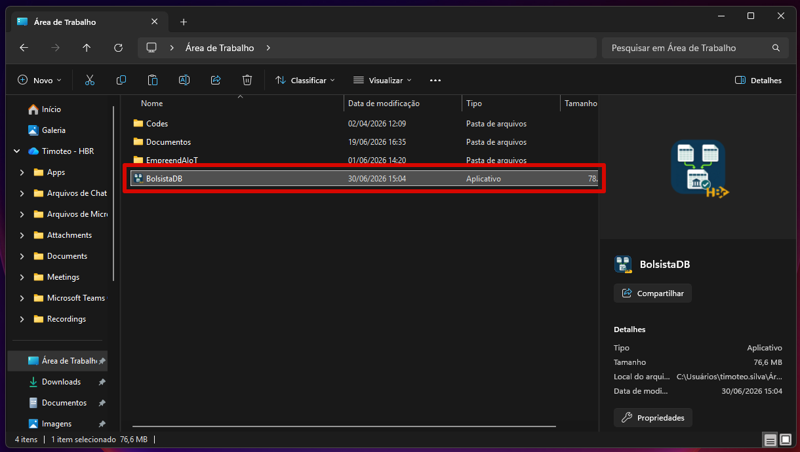

> [!Warning]
> É possível que o *Windows Defender* acuse o programa como "software perigoso". Neste caso, para executá-lo, você deve clicar em `Mais Informações` e, depois, no botão `Executar assim mesmo`.

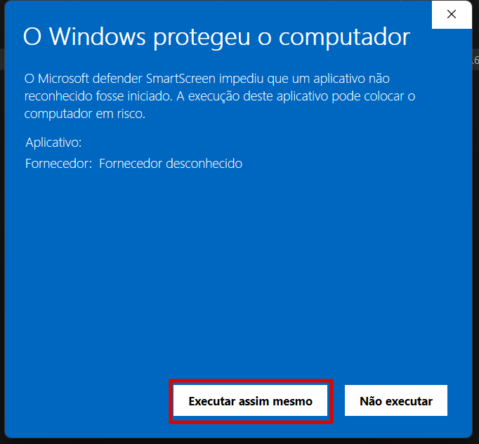

### 2.3 Interface do Programa

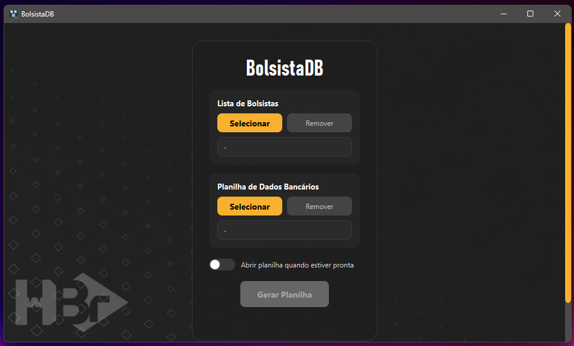

#### 2.3.1 Campos de Arquivos

O programa possui dois campos para inserção de arquivos (planilhas Excel) de entrada. São eles:

| Campo               | Extensões de arquivo aceitas | Padronização do arquivo                                                | Aceita mais de um arquivo? |
| ------------------- | ---------------------------- | ---------------------------------------------------------------------- | -------------------------- |
| Lista de Bolsistas  | .xlsx                        | [lista_alunos](assets/standard_sheets/lista_bolsistas.xlsx)            | Não                        |
| Formulário Bancário | .xlsx                        | [formulario_bancario](assets/standard_sheets/formulario_bancario.xlsx) | Não                        |

Para cada um dos campos, há dois botões: `Selecionar` e `Remover`. Ao clicar em `Selecionar`, o programa abre um diálogo do *Explorador de Arquivos*, permitindo que o usuário selecione o arquivo Excel correspondente ao campo.

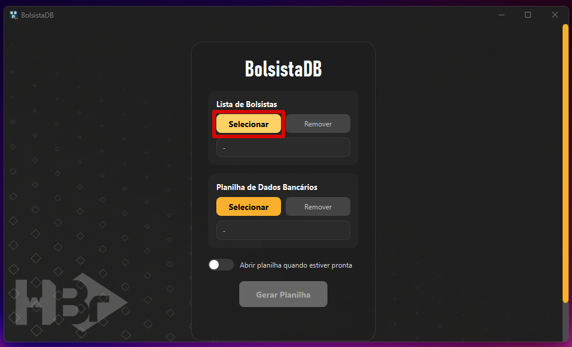

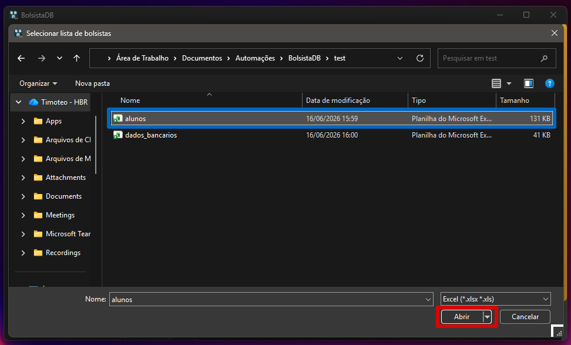

Após selecionar o arquivo, o campo de arquivo inserido é atualizado.

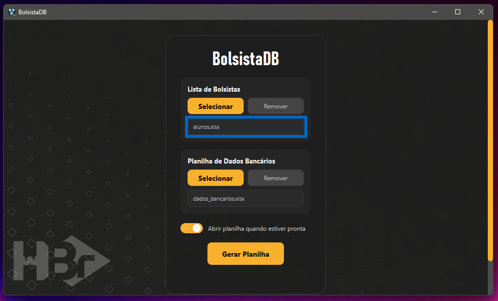

Ao clicar em `Remover`, se houver arquivo(s) selecionado(s) no campo correspondente, o programa remove o arquivo selecionado, deixando o campo vazio.

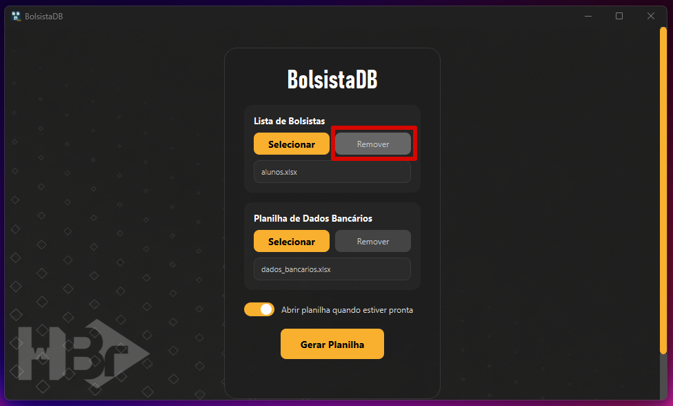

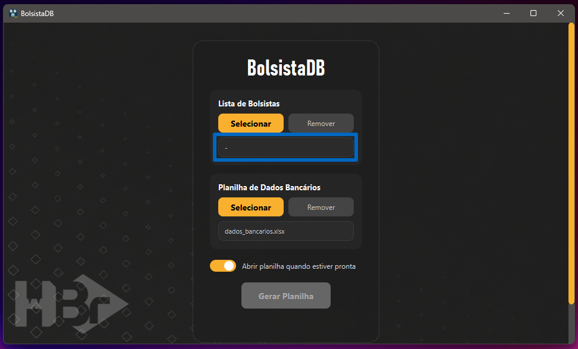

#### 2.3.2 Demais Recursos

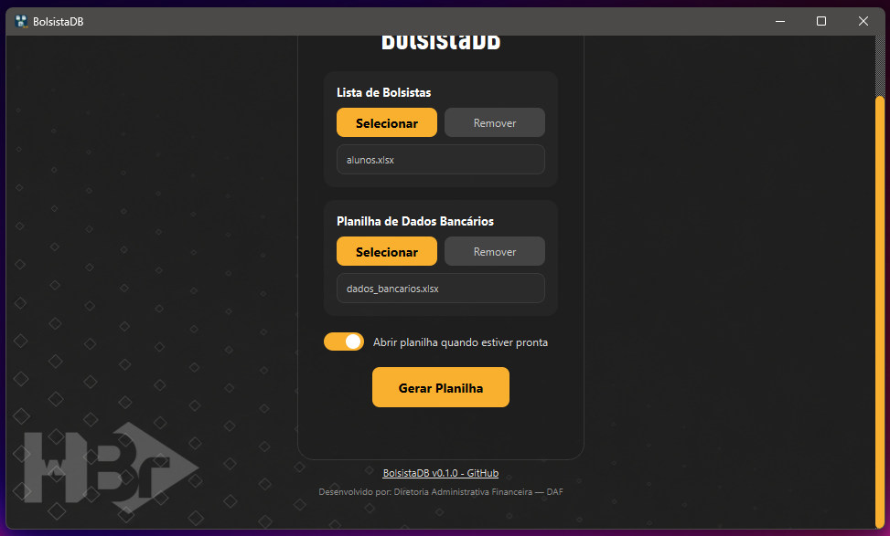

Além disso, o programa possui:
- `Abrir planilha quando estiver pronta`: Um **toggle switch** que permite que o usuário defina se a planilha de saída será aberta ou não após a execução do programa;
- `Gerar Planilha`: O botão que inicia a execução do programa.

### 2.4 Execução

Ao inserir uma Lista de Alunos e um Formulário de Dados Bancários, ao clicar em `Gerar Planilha`, o programa deve gerar uma planilha no formato [template](assets/standard_sheets/template.xlsx), com as colunas:

- `No.`: Contagem do item na planilha gerada (em relação ao total);
- `ID`: Número associado ao aluno/bolsista dentro de sua respectiva turma;
- `TURMA`: Turma na qual o aluno/bolsista está inscrito, conforme especificado na Lista de Bolsistas (as turmas são organizadas por ordem alfabética na planilha de saída);
- `NOME COMPLETO`: Nome completo do aluno/bolsista, conforme especificado na Lista de Bolsistas (os alunos são organizados por ordem alfabética dentro de suas turmas);
- `Data Início`: Data em que o aluno/bolsista iniciou no curso/projeto - deve ser inserida manualmente pelo usuário;
- `Data Final`: Data em que o aluno/bolsista saiu do/encerrou o curso - deve ser inserida manualmente pelo usuário;
- `E-MAIL`: E-mail do aluno/bolsista, conforme especificado na Lista de Bolsistas;
- `CPF`: CPF do aluno/bolsista, conforme especificado na Lista de Bolsistas;
- `RG`: RG do aluno/bolsista, conforme especificado na Lista de Bolsistas;
- `DATA NASCIMENTO`: Data de nascimento do aluno/bolsista, conforme especificado na Lista de Bolsistas;
- `ENDEREÇO COMPLETO (Logradouro-Bairro-Cidade)`: Informações de residência do aluno/bolsista, computadas a partir das informações de "ENDEREÇO", "BAIRRO", "CIDADE" e "ESTADO" na Lista de Bolsistas;
- `CEP`: CEP do aluno/bolsista, conforme especificado na Lista de Bolsistas;
- `Nome Responsável`: Nome do responsável pelo aluno/bolsista, caso este seja menor de idade, conforme especificado no Formulário de Dados Bancários;
- `CPF - Respon.`: CPF do responsável pelo aluno/bolsista, caso este seja menor de idade, conforme especificado no Formulário de Dados Bancários;
- `E-mail Respon.`: E-mail do responsável pelo aluno/bolsista, caso este seja menor de idade, conforme especificado no Formulário de Dados Bancários;
- `Contato Respon.`: Contato (número de celular) do responsável pelo aluno/bolsista, caso este seja menor de idade, conforme especificado no Formulário de Dados Bancários;
- `Nome do Banco`: Código e nome do banco associado ao aluno/bolsista, seja conta própria ou pertencente ao responsável, conforme especificado no Formulário de Dados Bancários;
- `Agência`: Agência bancária associada ao aluno/bolsista, seja conta própria ou pertencente ao responsável, conforme especificado no Formulário de Dados Bancários;
- `Díg.Ag`: Dígito da agência associada ao aluno/bolsista, seja conta própria ou pertencente ao responsável, conforme especificado no Formulário de Dados Bancários;
- `Conta`: Código da conta corrente associada ao aluno/bolsista, seja própria ou pertencente ao responsável, conforme especificado no Formulário de Dados Bancários;
- `Díg.C/C`: Dígito da conta corrente associada ao aluno/bolsista, seja própria ou pertencente ao responsável, conforme especificado no Formulário de Dados Bancários;

Caso o aluno seja menor de idade (o algoritmo checa a partir da data inserida em `DATA NASCIMENTO`), o programa acusará caso as colunas `Nome Responsável`, `CPF - Respon.`, `E-mail Respon.` e `Contato Respon.` estejam vazias. Para associar adequadamente as informações entre a Lista de Bolsistas e o Formulário de Dados Bancários, o programa procura por correspondências de **nome completo**, **CPF** e **data de nascimento**. Em caso de múltiplas correspondências ou nenhuma correspondência, o programa deve reportar os erros em um arquivo `.txt` salvo na mesma pasta (a ser escolhida) da planilha de saída.

> [!Note]
> O programa possui um algoritmo próprio de tratamento de dados bancários, os adequando a convenções especificadas para vários bancos (do banco de dados da FEBRABAN) conforme definido no arquivo [convencoes_bancos](assets/database/convencoes_bancos.pdf). Em caso de dados inconsistentes, os erros no algoritmo são reportados em colunas adicionais geradas na planilha de saída: `Status` e `Exceções do algoritmo`. Adicionalmente, as informações originais (inseridas pelos respondentes, antes do tratamento de dados) são disponibilizadas na planilha de saída, nas colunas adicionais `Banco (original)`, `Agência (original)`, `Díg.Ag (original)`, `Conta (original)` e `Díg.C/C (original)`.

> [!Note]
> Com os arquivos de entrada inseridos, ao clicar no botão `Gerar Planilha`, o programa deve fazer as correspondências entre a Lista de Bolsistas e o Formulário de Dados Bancários, gerando a planilha de saída (no formato especificado) e permitindo que o usuário escolha o local de salvamento do arquivo após o processamento.

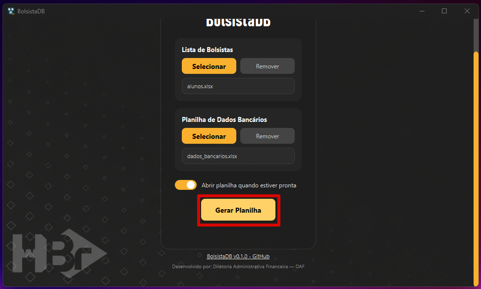

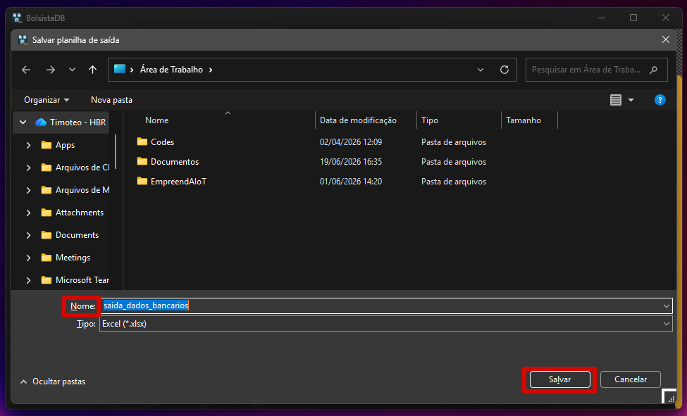

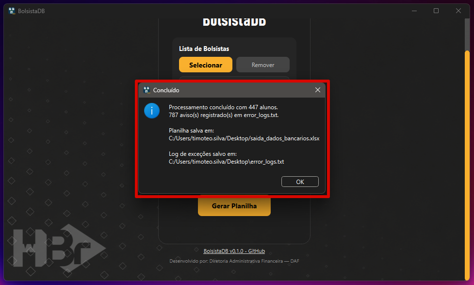

> [!Warning]
> Todos os erros de processamento, não correspondência e/ou inconsistência de dados são reportados no arquivo `error_logs.txt`, que é salvo na mesma pasta da planilha de saída.

## 3. Releases

### `v0.1.0` BolsistaDB (*beta release*)

> [!Warning]
> O lançamento beta (*beta release*) foi desenvolvido para testes internos, visando identificar e corrigir bugs antes do lançamento de uma versão estável.

Data de lançamento: `30/06/2026`

Para fazer o download desta versão, clique [aqui](https://github.com/imbaTIMvel/bolsistadb/releases/download/v0.1.0/BolsistaDB.exe).

*Release* inicial do programa de associação de dados entre planilhas para tratamento de dados bancários dos alunos/bolsistas.

**Features:**
===============================================================================================================================================================

Clique [aqui](https://github.com/imbaTIMvel/smartpc/releases) para acessar o **changelog completo**.

## 4. Desenvolvimento

**Autor:**

Timóteo Altoé (*handle*: [imbaTIMvel](github.com/imbaTIMvel))

**Datas:**

`29/04/2026` Início do projeto

`05/05/2026` Lançamento da versão *alfa* - para testes internos

`20/05/2026` Publicação da primeira versão oficial no GitHub

`21/05/2026` Lançamento da versão *beta* - para testes
